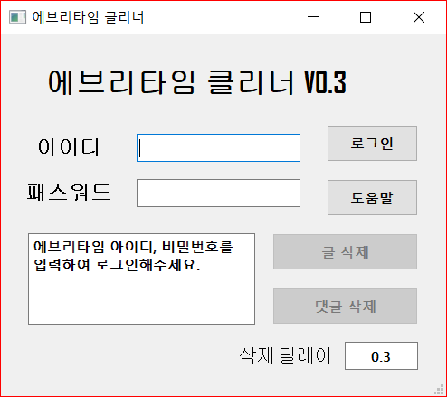

에브리타임 클리너
======

#### 간단한 조작으로 그동한 작성했던 수십, 수백개의 글, 댓글을 전부 지워줍니다.
#### 에브리타임 클리너를 사용하기 위해서는 'Google Chrome'과, C 드라이브에 'chromeDriver.exe 파일'이 필요합니다.

* EveryTimeCleaner폴더의 EveryTimeCleaner.exe 폴더로 실행합니다. 
* 크롬 브라우저와 크롬드라이버 파일의 버전이 일치해야 동작합니다.
* 크롬 드라이버는 https://chromedriver.chromium.org/downloads 에서 다운로드 받으실 수 있습니다.

  

어떻게 작동하나요?
------
  
#### 구글 크롬 브라우저를 제어하여 자동으로 로그인, 삭제를 수행합니다. 

* 모든 정보는 에브리타임 사이트로만 전송됩니다.
* 작동 중 발생한 문제를 위의 issues항목을 통해 알려주시면 해결에 도움이 됩니다.

  

Windows의 PC 보호 - 인식할 수 없는 앱이라 차단되었다고 나와요.
------
  
#### 프로그램에 전자서명이 없어서 그렇습니다. '추가 정보' 클릭시 실행 가능합니다.

* executable 파일을 신용할 수 없는 분들을 위해 파이썬 코드를 동봉합니다.
 
  
 
구글 드라이브 링크: https://drive.google.com/open?id=1MlN5JLUPnmqMp5edi86mpxEtFdcNXVjV
    

  
업데이트 이력
------
V0.1 CLI 버전 출시  
V0.2 GUI 버전 출시  
V0.3 로그인 간소화, 버그 픽스, 알고리즘 간결화
